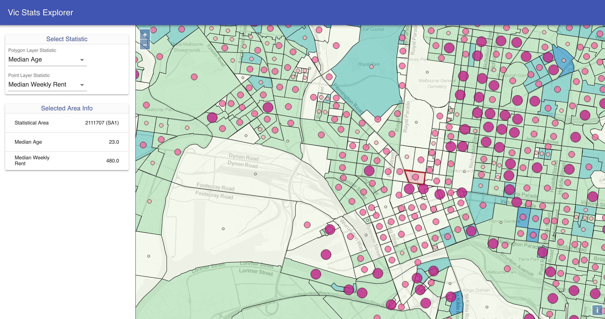

# 0 to 100 on AWS – Building a full stack web mapping application with PostGIS, GeoServer, OpenLayers and ReactJS

#### FOSS4G SotM Oceania - Afternoon Workshop #1 - 20th November 2018

> Please note that this repository is **archived** and **read only**.
> It is available as a reference, but is no longer actively maintained.

## Introduction

This 3.5 hour workshop is intended to provide an overview and hands-on
experience in deploying a full stack web mapping application using open source
geospatial technologies including GeoServer, PostGIS and OpenLayers.

By the end of the workshop the aim is to have a fully functional web app that
allows you to interactively explore a set of ABS statistics across Victoria.

| Section | Expected time to complete |
| --- | --- |
| [1. Prequisites and setup](section-1-setup.md) | 10 min |
| [2. Deploy AWS resources](section-2-aws.md) | 30 min |
| [3. Import data into PostGIS](section-3-data.md) | 30 min |
| [4. Deploy GeoServer instance](section-4-geoserver.md) | 10 min |
| [5. Publish vector tiles](section-5-publish.md) | 10 min |
| [6. Style vector tiles](section-6-style.md) | 25 min |
| [7. Client application](section-7.md) | |
| [7.1. Skeleton app](section-7-1-skeleton-app.md) | 35 min |
| [7.2. Redux and UI](section-7-2-ui.md) | 20 min |
| [7.3. Finish app](section-7-3-finish-app.md) | 30 min |
| [7.4. Publish app](section-7-4-publish-app.md) | 5 min |
| [8. Cleanup](section-8-clean.md) | |

## Feedback

We would love to get some feedback on the workshop. If you could spare a minute to fill in a [very short survey](https://geoplex.typeform.com/to/LJyqtr) after the workshop it would be appreciated.

## Acknowledgements

ABS data used with permission from the [Australian Bureau of Statistics](http://www.abs.gov.au).

Jenks classification PL/PgSQL functions from the [PostgreSQL extension for CartoDB](https://github.com/CartoDB/cartodb-postgresql).

## Credits

### Authors/Presenters

* Joseph O'Connell <joseph.oconnell@geoplex.com.au>
* Brendan Jurd <brendan.jurd@geoplex.com.au> / [github](https://github.com/direvus)
* Brent Schiller <brent.schiller@geoplex.com.au> / [github](https://github.com/b-schiller)

### Reviewers

* Chris Thomas
* Chris Comer

***

**Next**: [1. Prequisites and setup](section-1-setup.md)
