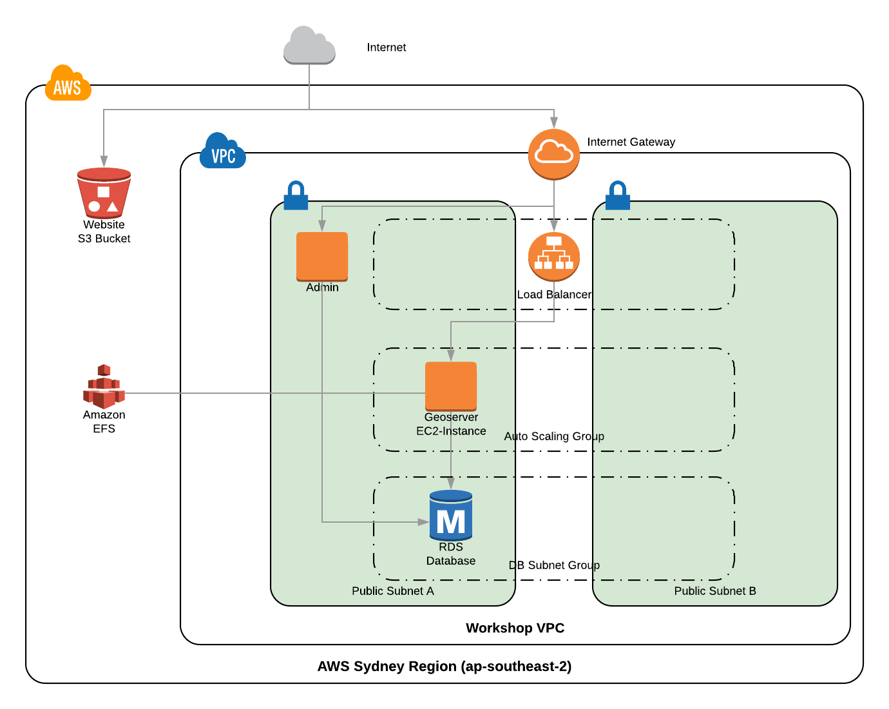
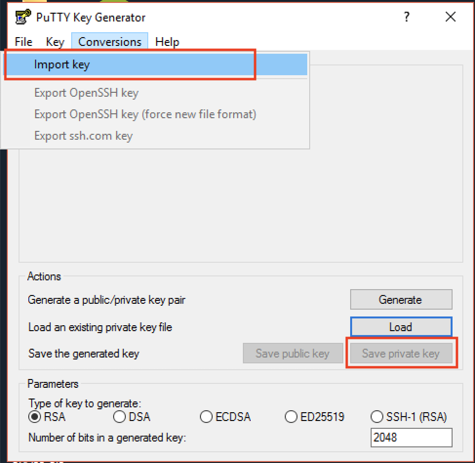
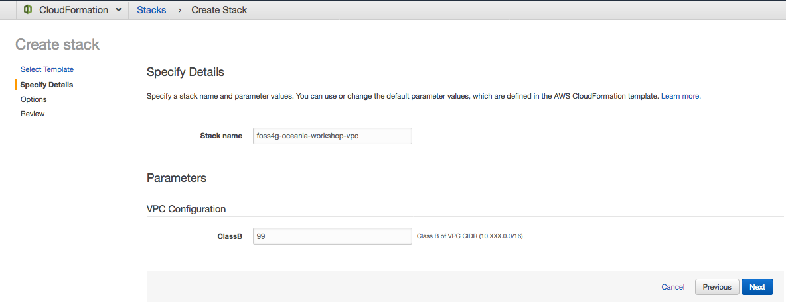
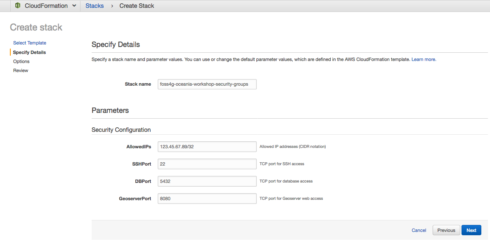
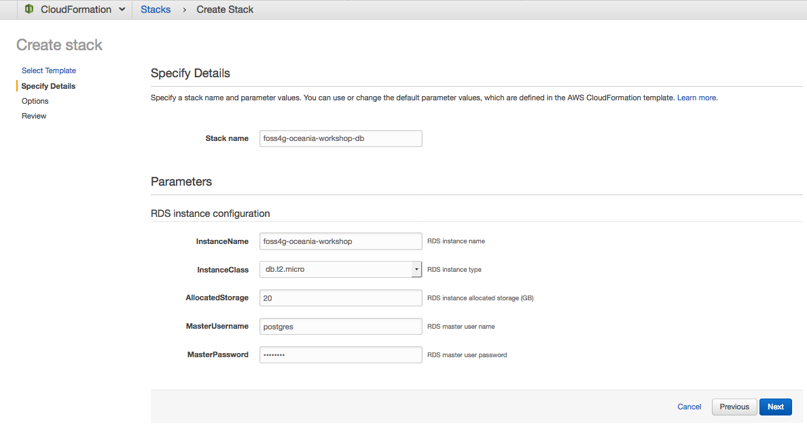
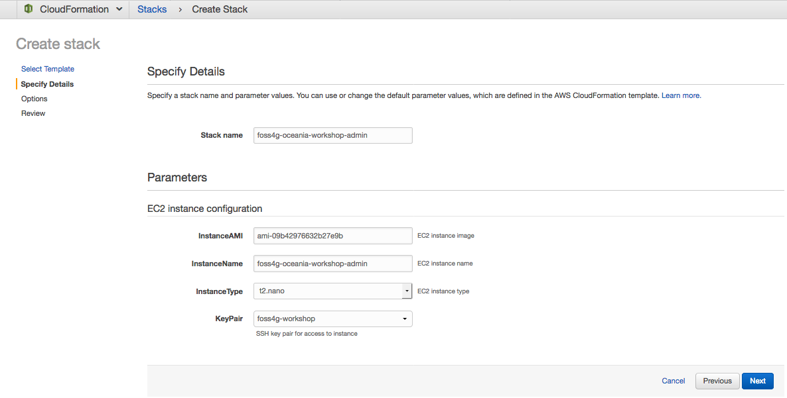

# 0 to 100 on AWS – Building a full stack web mapping application with PostGIS, GeoServer, OpenLayers and ReactJS

#### FOSS4G SotM Oceania - Afternoon Workshop #1 - 20th November 2018

## 2. Deploy AWS resources - VPC and PostGIS

To get started we're going to setup our environment in Amazon Web Services (AWS). 
For this workshop we'll be working in the AWS Sydney region, which is made up of 3
geographically isolated availability zones - A, B and C. We'll deploy a Virtual 
Private Cloud (VPC) network with subnets in 2 of those availability zones to allow
the system to scale or failover as needed. Then we'll deploy a PostgreSQL database,
Geoserver and an Administration instance. Finally we'll deploy an S3 bucket for 
hosting the static website:

### Create an SSH key pair

First you will need to set up an SSH key pair to access your AWS resources.  If
you already have an SSH key pair in your AWS account, and you have the private
key on your local machine, you can skip these next steps.  Otherwise, please:

1. Sign in to the [AWS console](https://signin.aws.amazon.com)
2. Select the ***EC2*** service
3. Select ***Network & Security > Key Pairs***
4. Select ***Create Key Pair***, or alternatively if you already have an SSH
   key on your local machine you would prefer to use, select ***Import Key
   Pair***.
5. Choose a unique name for the key (e.g. "foss4g-oceania-workshop") and select
   ***Create***.
6. The private key file will be downloaded on your local machine.
   Please note the location you the file is saved to, as you will need to use
   this private key when you connect to your instance over SSH.

### Configure PuTTY (Windows only)

If you are using Windows, there are some additional steps required to prepare
your SSH key for use with PuTTY:

1. Launch the PuTTYgen utility
2. Select ***Conversions > Import key*** from the menu bar
3. Choose the private key file you saved in the previous step 6.
4. PuTTYgen will populate the key details.  You can set a comment for the key
   if you wish, then under ***Actions***, select ***Save private key***.  You
   will be prompted to select a location and filename for the new key file in
   PuTTY's ".ppk" format.  Please note the location you select, as you will
   need to use this key file when you connect to your instance with PuTTY.

### Deploy CloudFormation stacks

To make things easier we've created some CloudFormation templates that we can use 
to deploy the workshop resources.

**CloudFormation** is an AWS service that allows you to define your AWS
resources in a template file as YAML or JSON and deploy them as 'Stacks'.
This approach (infrastructure-as-code) allows you to create reproducible and 
reusable deployments that can be tracked in version control.  

All of our CloudFormation templates are written in YAML, and include the following 
sections:
- AWSTemplateFormatVersion (optional) - CloudFormation template version
- Description (optional) - Informative description
- Metadata (optional) - Metadata about the template
- Parameters (optional) - Input parameters the template supports/requires
- Outputs (optional) - Defines output values to be made available to other templates
- Resources (required) - Defines the actual resources and their properties

We have four CloudFormation templates we'll be deploying in this section. There
are dependencies between these templates that mean they need to be deployed in 
order:
- 1-vpc-setup.yaml
- 2-security-groups.yaml
- 3-db-setup.yaml
- 4-admin.yaml

To open up the CloudFormation Console:

1. Sign in to the AWS console and select ***Services > CloudFormation***.
2. Ensure that you have the **Asia Pacific (Sydney)** region selected, as shown
   at the right hand side of the top navigation bar, between your user account
   and the Support menu.  If Sydney is not selected, drop down the region
   selector and choose Asia Pacific (Sydney).

#### Deploy network environment

The first stack will set up a basic network environment for our web application
resources.  Once the stack is deployed, we will have:
- A Virtual Private Cloud (VPC) with a class B IP address block
- A public subnet in each of two availability zones (A and B)
- An Internet Gateway for internet traffic
- Routing tables for network traffic
- Network ACLs which act as subnet level (stateless) firewalls

To create the Stack:
1. Select ***Create Stack***
2. Under ***Choose a template***, select ***Browse...*** to upload a template
   from your local machine.
3. Navigate to the directory where you extracted the workshop files, then under
   **cloudformation** choose the first template, named `1-vpc-setup.yaml` and
   select ***Next***.
4. Enter a name for the new stack.  We suggest `foss4g-oceania-workshop-vpc`.
   Then choose a class B IP address block for the VPC and select ***Next***.
5. Leave all settings under ***Options*** at their default values and select
   ***Next***.
6. Under ***Review***, select ***Create***.
7. Monitor the progress of your stack in the CloudFormation console until the
   stack status reads `CREATE_COMPLETE`.

#### Deploy security groups

The second stack will create a set of security groups (SGs) to control traffic
flowing into and within the VPC.  Once the stack is deployed, we will have SGs
to control our inbound connections:
- Admin Instance - port 22 (SSH)
- PostgreSQL Database- port 5432
- GeoServer - port 8080
We need to provide our own public IP address so that it can be specifically 
allowed access in each security group.

To create the Stack:
1. Determine your local machine's public facing IP address -- point your
   browser to [https://ipinfo.io](https://ipinfo.io) and copy the value shown
   under "ip" to your clipboard.
2. In the AWS CloudFormation console, select ***Create Stack***.
3. Under ***Choose a template***, select ***Browse...***, navigate to the
   workshop files and under **cloudformation** choose the template
   `2-security-groups.yaml`.  Select ***Next***.
4. Enter a name for the stack. We suggest `foss4g-oceania-workshop-security-groups`.
5. Paste your IP address into the AllowedIPs field, and add `/32` to the end of
   it to make it valid a CIDR address block.
6. Leave the rest of the parameters at their defaults and select ***Next***.
7. Leave all settings under ***Options*** at their default values and select
   ***Next***.
8. Under ***Review***, select ***Create***.
9. Monitor the progress of your stack in the CloudFormation console until the
   stack status reads `CREATE_COMPLETE`.

#### Deploy relational database

The third stack will launch an AWS Relational Database Service (RDS) instance. 
RDS provides managed database instances and makes it easy to setup and scale a 
relational database on AWS.
Once this stack is deployed, we will have a fully functional PostgreSQL
9.6 server running in our VPC public subnet and accessible from our allowed IP
address.

1. In the AWS CloudFormation console, select ***Create Stack***.
2. Under ***Choose a template***, select ***Browse...***, navigate to the
   workshop files and under **cloudformation** choose the template
   `3-db-setup.yaml`.  Select ***Next***.
3. Enter a name for the stack.  We suggest `foss4g-oceania-workshop-db`.
4. Choose a password for the database master user and enter it into the
   ***MasterPassword*** field.  You will need this password later on when you
   load the database schema. **Note: The password must be a minimum of 8 characters length**
5. Leave the rest of the parameters at their defaults and select ***Next***.
6. Leave all settings under ***Options*** at their default values and select
   ***Next***.
7. Under ***Review***, select ***Create***.
8. Monitor the progress of your stack in the CloudFormation console until the
   stack status reads `CREATE_COMPLETE`.

#### Deploy admin instance

The fourth stack will launch an administrative EC2 instance.  We will connect to
this instance over SSH and use it to load the database schema and seed data.
The CloudFormation template includes instructions for the newly launched admin
instance to install the Postgres client utilities and download the workshop
data files.

1. In the AWS CloudFormation console, select ***Create Stack***.
2. Under ***Choose a template***, select ***Browse...***, navigate to the
   workshop files and under **cloudformation** choose the template
   `4-admin.yaml`.  Select ***Next***.
3. Enter a name for the stack. We suggest `foss4g-oceania-workshop-admin`.
4. Under ***KeyPair***, choose the key pair which you previously created.
5. Leave the rest of the parameters at their defaults and select ***Next***.
6. Leave all settings under ***Options*** at their default values and select
   ***Next***.
7. Under ***Review***, select ***Create***.
8. Monitor the progress of your stack in the CloudFormation console until the
   stack status reads `CREATE_COMPLETE`.

***

**Previous**: [1. Prerequisites and setup](section-1-setup.md) | **Up**: [Index](README.md) | **Next**: [3. Import data into PostGIS](section-3-data.md)
