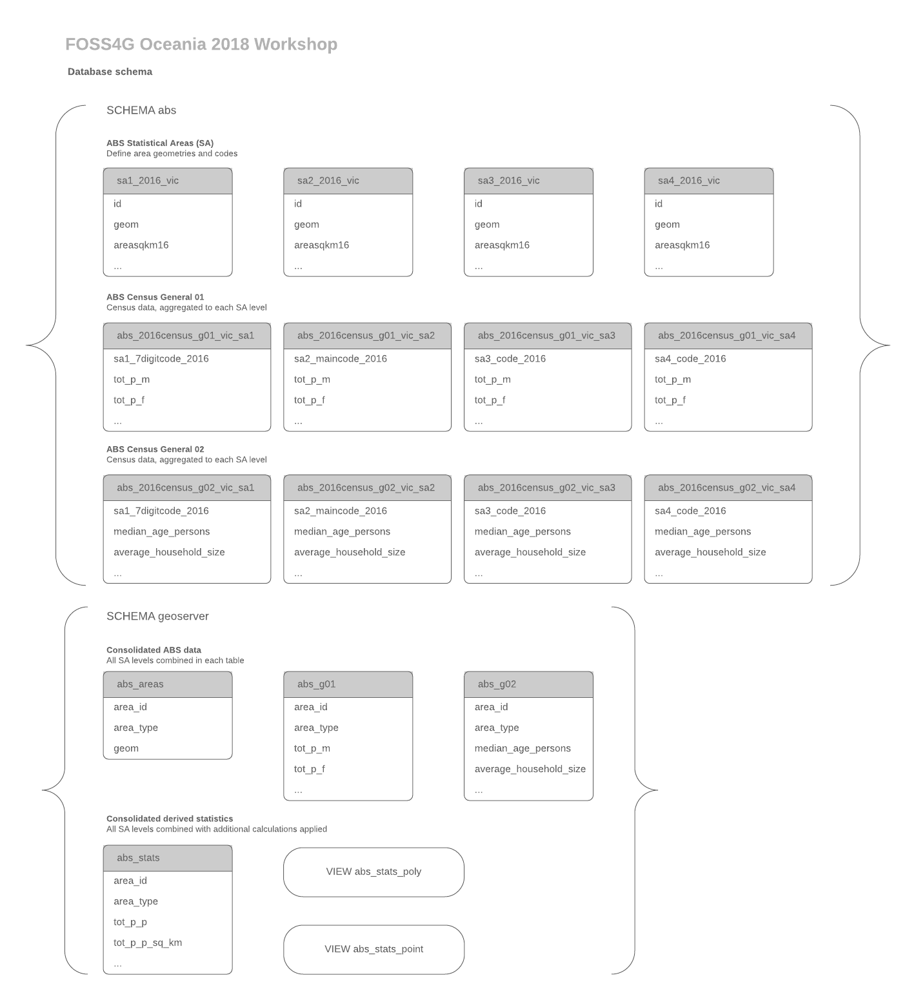
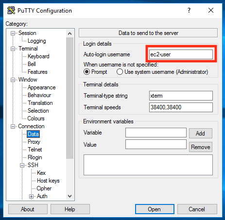
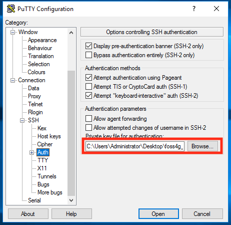
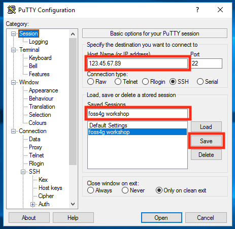
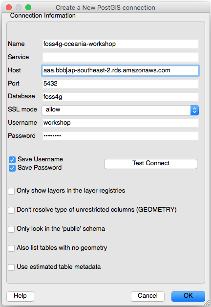
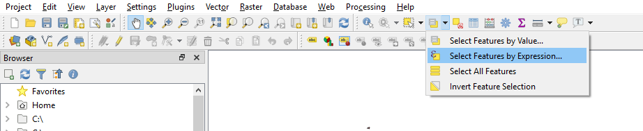
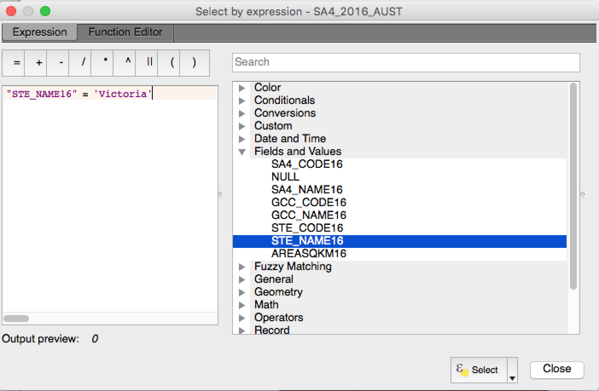
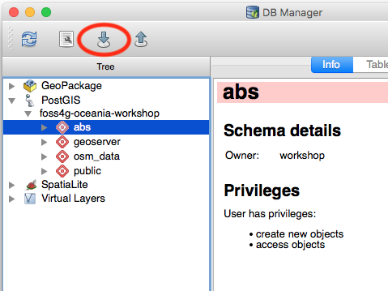
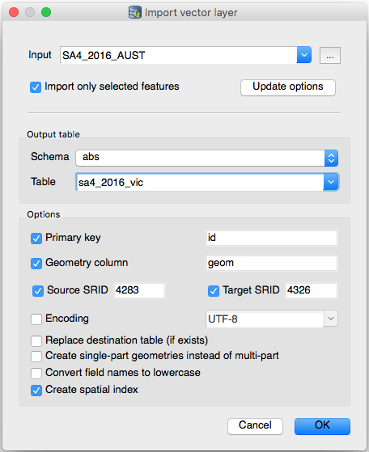

# 0 to 100 on AWS – Building a full stack web mapping application with PostGIS, GeoServer, OpenLayers and ReactJS

#### FOSS4G SotM Oceania - Afternoon Workshop #1 - 20th November 2018

## 3. Importing Data into PostGIS

In this section, we will populate our Postgres database with public geospatial
and census data from the Australia Bureau of Statistics.  At the end of the
section, our database will contain tables and views as shown in the following
diagram:



### Create database schema and user

Before we can import geospatial data into our relational database, we need to
configure the PostGIS extension and establish a database schema.  To do this,
we will connect to our admin instance over SSH and from there connect to to our
database using the `psql` Postgres command-line client.

#### Connect to admin instance with SSH

1. In the AWS console, go to ***Services > EC2***, and under ***Instances***,
   select your admin instance.
2. In the lower details pane, locate the "IPv4 Public IP" address and copy it
   to the clipboard.
3. Follow the relevant instructions below for Mac/Linux users (OpenSSH) or
   Windows users (PuTTY) to connect to the instance with your SSH client.

##### Mac/Linux users (OpenSSH)

1. Open your terminal and issue the following commands, substituting the path
   to your SSH private key file for <keyfile> and the IP address of your admin
   instance for <ipaddress>:

```
chmod 400 <keyfile>
ssh -i <keyfile> ec2-user@<ipaddress>
```

##### Windows users (PuTTY)

1. Launch the PuTTY client program.
2. In the left-hand menu, select ***Connection*** > ***Data***.
3. Under ***Login details > Auto-login username***, enter `ec2-user`.
4. In the left-hand menu, under ***Connection***, expand ***SSH*** and select
   ***Auth***.
5. Under ***Private key for authentication***, select ***Browse...*** and
   choose the .ppk key file you created with PuTTYgen earlier.
6. Go to the top of the left-hand menu, and select the ***Session*** category.
7. Under ***Basic options for your PuTTY session > Host name (or IP
   address)***, enter the public IP address of your admin instance.
8. Under ***Saved Sessions***, enter a name for this configuration (e.g.,
   ***foss4g-oceania***) and select ***Save***.
9. Select ***Open*** in the bottom button bar to start the SSH session.







When you have successfully established a SSH session to the admin instance, you
will be greeted with a banner of the following form:

```
       __|  __|_  )
       _|  (     /   Amazon Linux AMI
      ___|\___|___|

https://aws.amazon.com/amazon-linux-ami/2018.03-release-notes/
[ec2-user@ip-10-99-15-6 ~]$
```

#### Perform database setup

Now that we have a shell session on our admin instance, we can connect to our
database instance and create the database and user account for our application.
The CloudFormation template for the admin instance has already taken care of
installing the Postgres client tools and the files for the workshop, and for
convenience it has also populated the endpoint of the database instance in the
shell variable `DBHOST`.

To connect to your database instance, issue the following commands in your
shell session:

```
cd workshop
psql -h $DBHOST -U postgres foss4g
```

You will be prompted to enter the Postgres master account password that you
previously specified when you created the database CloudFormation stack.

When you have successfully connected to your Postgres database, you will see a
prompt like the following:

```
psql (9.6.10, server 9.6.6)
SSL connection (protocol: TLSv1.2, cipher: ECDHE-RSA-AES256-GCM-SHA384, bits: 256, compression: off)
Type "help" for help.

foss4g=>
```

Next, install the PostGIS extensions in the foss4g database with the following
SQL command:

```
CREATE EXTENSION postgis;
```

When the command has completed successfully, the Postgres server will respond
with the message `CREATE EXTENSION`.

Create a new database user account named 'workshop', with permissions to
connect and create objects in the foss4g database:

```
CREATE USER workshop;
GRANT ALL ON DATABASE foss4g TO workshop;
\password workshop
```

You will be prompted to create a password for the new 'workshop' user account.
You will need this password when connecting to the database from QGIS and when
configuring GeoServer.

Re-connect to the database as the new workshop user.  You will be prompted to
enter the password that you have just set.  After this step, there will be no
further need to connect to the database as the master 'postgres' user.

```
\c - workshop
```

Note: the first argument to the `\c` ("connect") psql command is the database
to connect to.  The hyphen is a shorthand, meaning to reconnect to the current
database.

Next, create database schemas to contain the data:

```
CREATE SCHEMA abs;
CREATE SCHEMA geoserver;
```

Finally, disconnect from the database server and exit from psql with the `\q`
("quit") command:

```
\q
```

### ABS Statistical Area Shapefiles

To load in the ABS Statistical Area level 4 shapefiles, we will use QGIS to
filter and load the Victorian areas only.

#### Create a connection to the PostGIS database in QGIS.

For the next step, you will need the DNS endpoint for your database instance.
You can find this in the AWS RDS console under instance details, or
alternatively just print it to the shell in your SSH session on the admin
instance:

```
echo $DBHOST
```

1. Launch QGIS on your local machine.
2. From the Layer Menu select ***Add Layer > Add PostGIS Layers...***
3. Select to create a ***New*** PostGIS connection.
4. Enter a name for the connection (e.g., "foss4g-oceania-workshop").
5. Under ***Host***, paste the DNS endpoint for your database instance. ***Note:*** You can find the DNS endpoint for the database instance in the AWS console under ***Services > RDS > Instances*** then select your instance and copy the ***Endpoint*** value.
6. Under ***Database***, enter `foss4g`.
7. Under ***SSL mode***, select "allow".
8. Under ***Username***, enter `workshop`, and under ***Password*** enter the
   password you set for the workshop database user previously.
9. Opt to save the username and password with the connection.
10. Test the connection and then click OK.



#### Load the ABS Statistical Area level 4 Shapefiles into PostGIS

We will be using QGIS to load the SA4 geometries into our database.

1. Locate the contents of the extracted ABS SA4 zip package on your local
   machine.
2. You can add the layer into QGIS by either using the ***Add Layer > Add
   Vector Layer...*** command from the ***Layer*** menu, or just drag and drop
   the `SA4_2016_AUST.shp` file into the ***Layers Panel***.  You should now
   see a map of Australia with the SA4 geometries shown in the main map view
   pane.
3. In the ***Layers Panel***, click on the SA4_2016_AUST layer so that it is
   highlighted and then click the ***Select features using an expression***
   button from the toolbar (see screenshot below).

4. Select the Victorian statistical areas by entering the expression
   `"STE_NAME16" = 'Victoria'` into the dialog as per the screenshot below.
   Click on ***Select***, then ***Close***.  You should now see the Victorian
   SA geometries highlighted with a different background colour in the main map
   view pane.

4. From the ***Database*** menu open the ***DB Manager > DB Manager*** dialog.
5. In the ***Tree*** panel, under ***PostGIS***, expand your database
   connection, click on the ***abs*** schema, then the ***Import layer/file***
   button from the toolbar (see screenshot below).

6. Select the ***Import only selected features*** option, to limit the import
   to Victoria only.
7. Select ***Update options*** to automatically populate part of the form from
   the source layer.
8. Under ***Output table***, select the `abs` schema and enter `sa4_2016_vic`
   for the table name.
9. Select options ***Primary key***, ***Geometry column***, ***Source SRID***,
   ***Target SRID*** and ***Create spatial index***.
10. In the ***Target SRID*** field, enter ***4326***.

11. Select OK to load the data.

QGIS will create a new table in the database, populate it with the SA4 areas
and create a GIST index on the geometry column.  This should take around a
minute to complete, then QGIS will show a message indicating success.

You can explore the details of the newly created table in the DB Manager, by
expanding the `abs` schema and selecting the `sa4_2016_vic` table entry.

#### Load ABS SAs 1-3 and Census Data into PostGIS

We could repeat the above process for the rest of the workshop data, but these
are non-trivial datasets and the full import process could take as long as an
hour to complete.  We have provided an SQL script that will instead load
Statistical Areas levels 1-3, plus G01 and G02 from the 2016 Census General
Community Profile data, in a matter of seconds.

We will run this script using the Postgres `psql` client utility on our admin
instance.  Return to your SSH session on the admin instance, or reconnect if
the session has been dropped due to inactivity.  Then issue the following
commands:

```
cd ~/workshop
psql -h $DBHOST -U workshop foss4g
```

You will again be prompted to enter the password for the `workshop` database
user.  When you arrive at the psql command prompt, use the `\i` ("import")
command to load the first SQL script:

```
\i 1-abs-data.sql
```

You will see a series of command confirmations from the Postgres server.

In addition to the `sa4_2016_vic` table you created from QGIS, the `abs`
schema now contains the following tables, fully populated and indexed:

* `abs_2016census_g01_vic_sa1`
* `abs_2016census_g01_vic_sa2`
* `abs_2016census_g01_vic_sa3`
* `abs_2016census_g01_vic_sa4`
* `abs_2016census_g02_vic_sa1`
* `abs_2016census_g02_vic_sa2`
* `abs_2016census_g02_vic_sa3`
* `abs_2016census_g02_vic_sa4`
* `sa1_2016_vic`
* `sa2_2016_vic`
* `sa3_2016_vic`

You can confirm this by running the `\dt` ("describe tables") command, with a
pattern to match all tables in the `abs` schema:

```
\dt abs.*
```

#### Create Consolidated Tables and Views for Publication in GeoServer

Next we will be pulling the ABS data into consolidated tables containing all of
the SA levels together, and calculating some basic derived statistics for
display in our web map.

We will be running a series of SQL scripts to create functions, tables and
views in the `geoserver` database schema.  The first of these pulls in Jenks
classification functions from the CartoDB PostgreSQL extension.  Enter the
following at the psql command prompt to create these functions:

```
\i 2-cartodb-quantile.sql
\i 3-cartodb-jenks.sql
\i 4-jenks.sql
```

Next, we will create consolidated data tables in the `geoserver` schema, and
then populate them by combining SAs 1-4 from the data in the `abs` schema we
loaded previously.  Enter the following at the psql command prompt:

```
\i 5-geoserver-consolidate.sql
```

After running this script, you will have the following tables in the
`geoserver` schema:

* `abs_areas`
* `abs_g01`
* `abs_g02`

You can confirm this by running the command `\dt geoserver.*` in your psql
session.

Next, we will calculate and index some basic derived statistics from these
consolidated tables, for display in our map application, such as the population
per square kilometre of area within SAs in various categories, and the Jenks
classes for same.  Enter the following at the psql command prompt:

```
\i 6-geoserver-stats.sql
```

After running this script, you will have one additional table in the
`geoserver` schema, named `abs_stats`.

Finally, we will create two database views of the `abs_stats` table, to serve
as the basis for our published layers in GeoServer:

* `abs_stats_poly` includes each area's boundary as the `geom` field.
* `abs_stats_point` includes each area's centroid as the `geom` field.

Enter the following at the psql command prompt:

```
\i 7-geoserver-views.sql
```

You can confirm the results by running the command `\dv geoserver.*` in your
psql session.

The data is now ready for publication by GeoServer.  You can close your psql
session by entering `\q` ("quit") and then exit your SSH session by entering
`exit`.

#### Stop the admin instance

Since we won't be needing the admin instance for the remainder of the workshop,
you can stop the instance and not incur any further hourly charges for it.  To
stop the instance:

1. In the AWS console, select ***Services > EC2***.
2. Under ***Instances***, select the admin instance.
3. Select ***Actions > Instance State > Stop***.
4. Check the details in the confirmation dialog and select ***Yes, Stop*** to
   proceed.

***

**Previous**: [2. Deploy AWS resources](section-2-aws.md) | **Up**: [Index](README.md) | **Next**: [4. Deploy Geoserver](section-4-geoserver.md)
