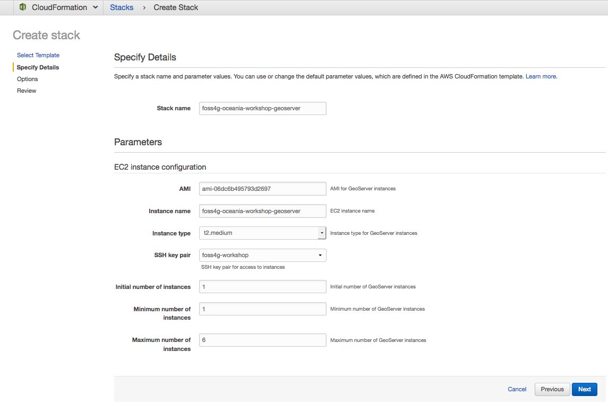

# 0 to 100 on AWS – Building a full stack web mapping application with PostGIS, GeoServer, OpenLayers and ReactJS

#### FOSS4G SotM Oceania - Afternoon Workshop #1 - 20th November 2018

## 4. Deploy GeoServer instance

We will now deploy a CloudFormation stack to create an auto-scaling group and
load balancer for our GeoServer instances.  We will be using a pre-prepared AMI
with Tomcat and GeoServer already installed.

1. In the AWS CloudFormation console, select ***Create Stack***.
2. Under ***Choose a template***, select ***Browse...***, navigate to the
   workshop files and under **cloudformation** choose the template
   `5-geoserver.yaml`.  Select ***Next***.
3. Enter a name for the stack. We suggest `foss4g-oceania-workshop-geoserver`.
4. Under ***KeyPair***, choose the key pair which you previously created.
5. Leave the rest of the parameters at their defaults and select ***Next***.
6. Leave all settings under ***Options*** at their default values and select
   ***Next***.
7. Under ***Review***, select ***Create***.
8. Monitor the progress of your stack in the CloudFormation console until the
   stack status reads `CREATE_COMPLETE`.

The pre-prepared GeoServer AMI was produced using
**[Packer](https://packer.io/)** and **[Ansible](https://www.ansible.com/)**.

**Packer** automates the process of creating an AMI -- it launches a new EC2
instance, connects to it over SSH, runs a "provisioner" to configure the
instance, then finally shuts the instance down and creates a new AMI from the
instance volume.

**Ansible** acts as the provisioner for Packer -- it provides a structured
format for a repeatable set of tasks.  In our case, we use an Ansible playbook
to download, install and configure Oracle Java, Apache Tomcat and GeoServer.

If you're interested in learning more about the AMI build, or customising it to
create your own AMIs, see the `packer` and `ansible` directories within the
workshop repository.

***

**Previous**: [3. Import data into PostGIS](section-3-data.md) | **Up**: [Index](README.md) | **Next**: [5. Publish vector tiles](section-5-publish.md)
