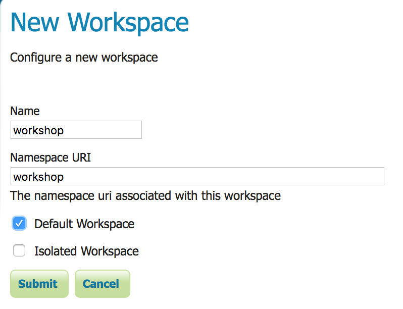
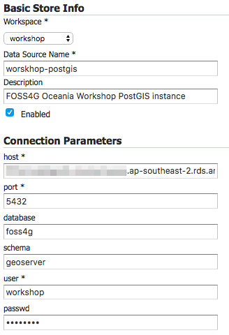
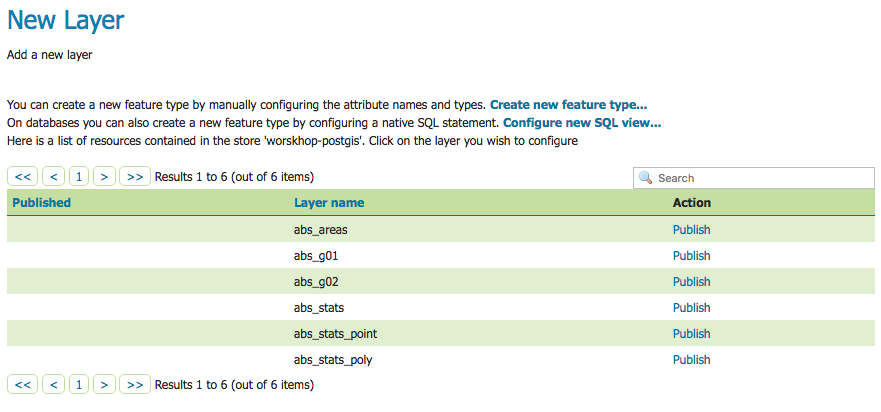
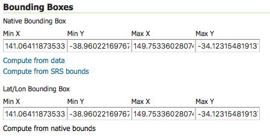
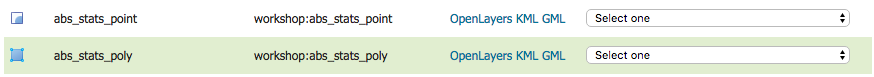
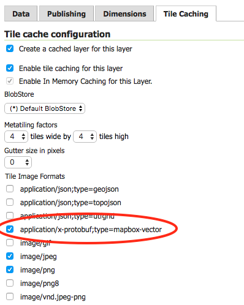

# 0 to 100 on AWS – Building a full stack web mapping application with PostGIS, GeoServer, OpenLayers and ReactJS

#### FOSS4G SotM Oceania - Afternoon Workshop #1 - 20th November 2018

## 5. Publish Vector Tiles in GeoServer

With GeoServer deployed in an autoscaling group and the database deployed and populated with ABS data, we can now add the service layer into the stack by publishing some OGC web services in Mapbox Vector Tile (MVT) format.

The GeoServer AMI has several plugins already installed, including the [Vector Tiles core extension](http://docs.geoserver.org/stable/en/user/extensions/index.html#extensions) and the [Mapbox Styles community module](http://docs.geoserver.org/stable/en/user/community/index.html).

**1.** In the AWS console, select ***Services > EC2***.

**2.** Under ***Load Balancers***, select the load balancer that was deployed in the previous section (it should have a name like ***foss4-Geose-XXXXXXXXXXXXX***), and under ***Description > Basic Configuration***, find and copy the DNS name to the clipboard.

**3.** Open a new web browser window or tab, and go to the URL `http://<Load Balancer DNS name>/geoserver/web`

**4.** You should be presented with the GeoServer login page. Login to the GeoServer web admin interface with user ***admin*** and password ***geoserver***. For this workshop, we'll just leave the password for the admin user at its default. You can change the password under ***Users, Groups, Roles > Users / Groups***

**5.** First we'll add a workspace to organise the workshop GeoServer resources. Open the ***Data > Workspaces*** page and click on ***Add new workspace***. Add a new workspace with name ***workshop*** and Namespace URI ***workshop*** and select the ***Default Workspace*** checkbox.

**6.** Now we'll add a store so that we can publish tables and views from PostGIS as services. Open the ***Stores*** page and click on ***Add new store***.

**7.** When prompted to select the data source, select ***Vector Data Sources > PostGIS***.

**8.** Create the store using the values in the table below. Note: to get the database host value, open the AWS console and locate the RDS instance you deployed earlier in the ***RDS > Instances*** and copy the ***Endpoint***.

| Parameter | Value |
| --- | --- |
| Workspace | `workshop` |
| Data Source Name | `workshop-postgis` |
| Description | `FOSS4G Oceania Workshop PostGIS instance` |
| host | `<RDS_ENDPOINT>` |
| port | `5432` |
| database | `foss4g` |
| schema | `geoserver` |
| user | `workshop` |
| password | `<WORKSHOP_USER_PASSWORD>` |

**9.** Leave the remaining parameters with default values and then press ***Save***.

**10.** You should then be presented with the ***New Layer*** page, from which you can publish the tables/views in the `geoserver` schema as services.

**11.** First we'll publish the points layer. From the table, locate the `abs_stats_point` layer and click ***Publish***.

**12.** The ***Edit Layer*** page should be displayed. Locate the ***Bounding Boxes*** section and for the ***Native Bounding Box*** click ***Compute from data***. For the ***Lat/Lon Bounding Box*** click ***Compute from native bounds***.

**13.** Leave the rest of the properties with the default values and click ***Save***.

**14.** Now we'll publish the polygon layer. From the ***Layers*** page, click ***Add a new layer*** and select the ***workshop:workshop-postgis*** store. Follow the process outlined above to publish the `abs_stats_poly` layer.

**15.** The layers are now published and you can preview them in a variety of formats on the ***Data > Layer Preview*** page (i.e. click on ***OpenLayers*** to preview as a simple web map).

**16.** The final step is to enable the Mapbox Vector Tile format on the published layers. Open the ***Tile Caching > Tile Layers*** page.

**17.** Select the `workshop:abs_stats_point` layer from the table and then on the ***Edit Layer*** page, select the ***Tile Caching*** tab and activate the ***application/x-protobuf;type=mapbox-vector*** checkbox under the ***Tile Image Formats***. Click ***Save***.

**18.** Repeat the process to enable Mapbox Vector Tiles on the `workshop:abs_stats_poly` layer.

***

**Previous**: [4. Deploy Geoserver](section-4-geoserver.md) | **Up**: [Index](README.md) | **Next**: [6. Style vector tiles](section-6-style.md)
