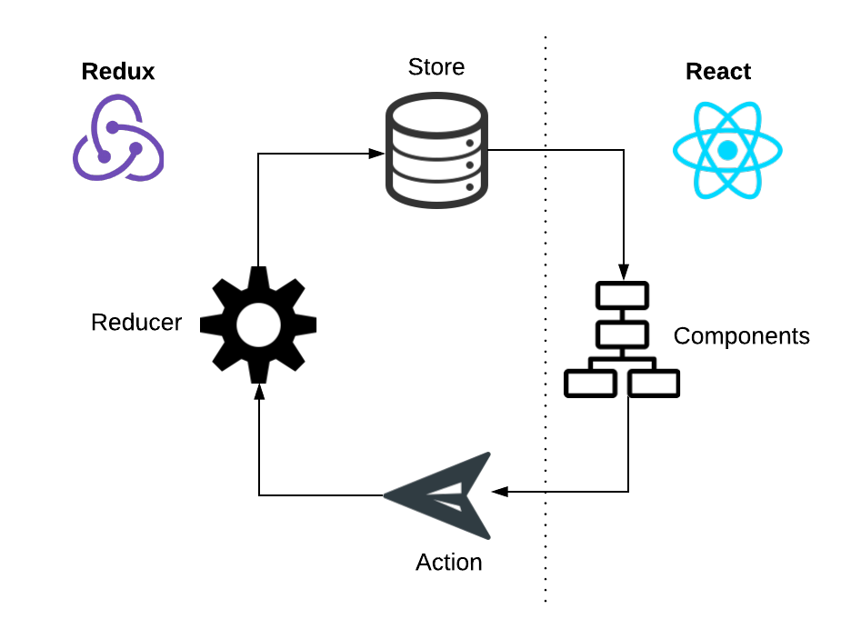
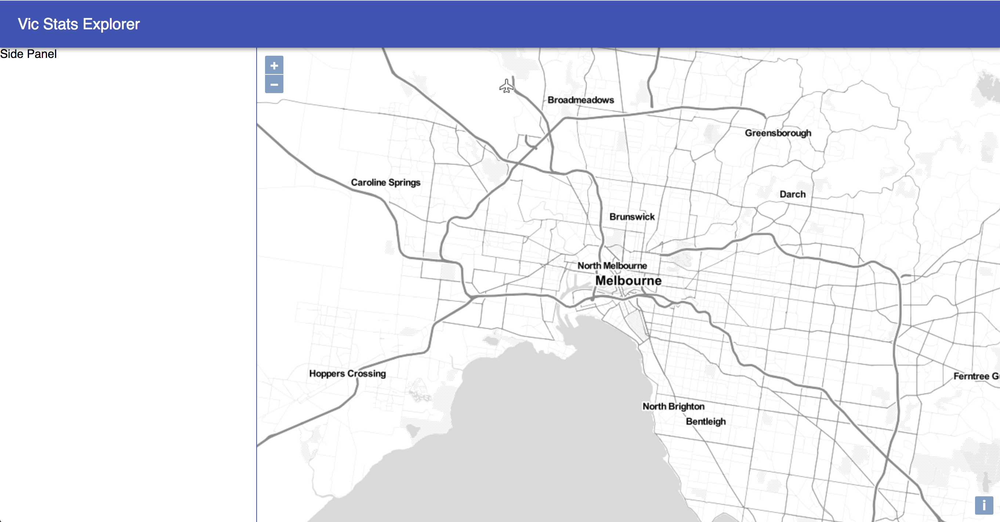

# 0 to 100 on AWS – Building a full stack web mapping application with PostGIS, GeoServer, OpenLayers and ReactJS

#### FOSS4G SotM Oceania - Afternoon Workshop #1 - 20th November 2018

### Section 7 Stage 1 - Skeleton App

React is a Javascript library developed by Facebook that can be used to compose complex UIs as a collection of reusable components. React supports a declarative syntax (JSX), and provides efficient rendering and flexible component lifecycles.

Redux is an open-source JavaScript library for managing application state, independent of any particular UI framework. There are three key things to know about Redux:

1. The entire application state is stored in a single store as an object tree
2. The only way to change the state is by generating predefined actions. 
3. Developers define how actions change state by implementing reducers (which are just pure functions)

When combined with React, Redux helps maintain consistent application state which can be provided to React and rendered via components. React components can trigger actions which update the Redux state, which is then fed back to React causing components to re-render as required:



**1.** To get started we'll use Facebook's [create-react-app](https://github.com/facebook/create-react-app) tool to bootstrap a React application. 

create-react-app provides not just the React libraries, but also a project structure and some preconfigured build tools:

- Babel - compiler/transpiler for ES6 and JSX
- Webpack - module bundler for code and dependencies

Open a terminal window and navigate to your development directory (e.g., `~/src`). Run the following command to bootstrap the application.

```
npx create-react-app foss4g-client
```

**2.** Once it's finished you should be able to start a local development server by entering the following commands.

```
cd foss4g-client
npm start
```

**3.** Your browser should open at [http://localhost:3000](http://localhost:3000) and display a basic web page with the React logo.

**4.** Now we'll install some dependencies using npm. Return to your terminal and press `<Ctrl>+c` to terminate the development web server and then run the following command.

```
npm add @material-ui/core@1.5.0 immutable@3.8.2 isomorphic-fetch@2.2.1 ol@4.6.5 ol-mapbox-style@2.11.2 react-redux@5.0.7 redux@4.0.0 redux-thunk@2.3.0
```

**5.** Create two configuration files to store environment-specific configuration for the application at `.env.local` and `.env.production`, both populated with the following content. These files allow different configuration to be used when developing locally versus deploying to production.

`REACT_APP_BASE_GEOSERVER_URL=http://<GeoServer Load Balancer DNS Name>/geoserver`

For example, to set these files up in Bash:

```
echo="REACT_APP_BASE_GEOSERVER_URL=http://<GeoServer Load Balancer DNS Name>/geoserver" >> .env.local
cp .env.local .env.production
```

**6.** Now we'll set out the basic folder structure for the application to organise our code. Create subdirectories under the `src` folder so that it matches the following.

```
|-- src
|   |-- components
|   |-- containers
|   |   |-- app
|   |-- external
|   |-- modules
```

For example:

```
cd src
mkdir -p components
mkdir -p containers/app
mkdir -p external
mkdir -p modules
```

**7.** We're not going to worry about tests for this demo app so you can delete the `App.test.js` file from the root directory:

```
rm App.test.js
```

**8.** Move the `App.js` file down into the `containers/app` directory:

```
mv App.js containers/app/
```

**9.** Open `index.js` in your editor of choice, and modify the `App` import line to read:

```
import App from './containers/app/App';
```

**10.** Now we'll start creating the application layout and the main skeleton
React components (see
[what's a component?](https://reactjs.org/docs/components-and-props.html)).
We'll be using [JSX](https://reactjs.org/docs/introducing-jsx.html) syntax to
define our components.

The general layout of the app will consist of:

- a header bar,
- a left panel containing some controls to interact with the map, and
- the interactive map itself.

**11.** Let's start by deleting the `App.css` and `logo.svg` files provided by
create-react-app, as we're going to manage styles in JavaScript within each
component, and we no longer need the default logo.

```
rm App.css
rm logo.svg
```

**12.** We'll start by adding a Header component and giving the application a
title. Create a new file called `components/AppHeader.js` and populate with
the following code. This defines a React component that re-uses some components
from Material UI, and provides a header and title for the application. Feel
free to get creative with the title of your application!

```
import React, { Component } from 'react'
import AppBar from '@material-ui/core/AppBar'
import Toolbar from '@material-ui/core/Toolbar'
import Typography from '@material-ui/core/Typography'

class AppHeader extends Component {
  render() {
    return (
      <AppBar position="fixed" color="primary">
        <Toolbar>
          <Typography variant="title" color="inherit">
            Vic Stats Explorer
          </Typography>
        </Toolbar>
      </AppBar>
    )
  }
}

export default AppHeader;
```

**13.** Next up, modify the `containers/app/App.js` file to reference our new
AppHeader component. Replace the contents of the file with the following code.
"App" is the top level component of the application and uses the Material UI
`MuiThemeProvider` to propagate a theme to child components in the application.
This way you can quite easily update the colours and fonts throughout the
entire application.

We're also defining a style object to provide the basic CSS layout and styling
of the application.

```
import React, { Component } from 'react';
import { MuiThemeProvider, createMuiTheme } from '@material-ui/core/styles';
import AppHeader from '../../components/AppHeader';

const theme = createMuiTheme();

const styles = {
  app: {
    height: '100%',
    width: '100%'
  }
}

class App extends Component {
  render() {
    return (
      <MuiThemeProvider theme={theme}>
        <div style={styles.app}>
          <AppHeader/>
        </div>
      </MuiThemeProvider>
    );
  }
}

export default App;
```

**14.** Start up the development web server again (`npm start` in the
top-level foss4g-client directory) and point your browser to
[http://localhost:3000](http://localhost:3000).  You should see a header bar
showing your application title.

**15.** Now let's add in the Side Panel and Map components. Create a file
`components/OlMap.js` and populate with the following content. This sets out a
basic map component using OpenLayers and a Stamen base map. Note that
this component includes a couple of React lifecycle methods:
`componentDidMount` and `componentDidUpdate`. These lifecycle methods provide
hooks to manage changes to the map.  In `componentDidMount`, we are making
OpenLayers API calls to initialise the map and position the view.  Later on
we'll be using `componentDidUpdate` to update the map in response to state
changes in the application.

```
import React, { Component } from 'react'
import Map from 'ol/map'
import View from 'ol/view'
import TileLayer from 'ol/layer/tile'
import Stamen from 'ol/source/stamen'
import 'ol/ol.css'


class OlMap extends Component {
  constructor(props) {
    super(props)
    this.map = null
  }

  componentDidMount() {
    this.loadMap()
  }

  componentDidUpdate(prevProps, prevState) {

  }

  loadMap () {
    let self = this
    let layers = [
      new TileLayer({
        source: new Stamen({
          layer: 'toner-lite'
        })
      })
    ]
    self.map = new Map({
      layers: layers,
      target: 'map',
      view: new View({
        center: [16137312, -4553696],
        zoom: 11
      })
    })
  }

  render() {
    return (
      <div id='map' style={this.props.style} />
    )
  }
}

export default OlMap;
```

**16.** Add a new file `components/SidePanel.js` with the following content.

```
import React, { Component } from 'react'

class SidePanel extends Component {
  render() {
    return (
      <div style={this.props.style}>
        Side Panel
      </div>
    )
  }
}

export default SidePanel;
```

**17.** Now modify the `containers/app/App.js` file to include our new
components. Modify the `styles` object to include the following properties.
Notice that we're referring to the Material UI theme palette to set the right
border of the side panel.

```
let styles = {
  ...,
  sidePanel: {
    height: 'calc(100% - 64px)',
    width: 349,
    position: 'absolute',
    marginTop: 64,
    borderRight: '1px solid ' + theme.palette.primary.main
  },
  map: {
    height: 'calc(100% - 64px)',
    width: 'calc(100% - 350px)',
    position: 'absolute',
    marginTop: 64,
    marginLeft: 350
  }
}
```

**18.** Now we'll add in the `SidePanel` and `OlMap` components to complete the
basic application layout. First import the components and then place them
within the containing <div> element in `containers/app/App.js`:

```
import OlMap from '../../components/OlMap';
import SidePanel from '../../components/SidePanel';

...

<MuiThemeProvider theme={theme}>
  <div style={styles.app}>
    <AppHeader/>
    <SidePanel
      style={styles.sidePanel}
    />
    <OlMap
      style={styles.map}
    />
  </div>
</MuiThemeProvider>
```

**19.** In the browser your app should now have a skeleton layout with a header, side panel and interactive map component. If necessary you can [download](https://s3-ap-southeast-2.amazonaws.com/foss4g-oceania-2018-workshop-resources/client_stage_1.zip) a copy of the `src` directory at this point.



***

**Previous**: [7. Client application](section-7.md) | **Up**: [Index](README.md) | **Next**: [7.2. Redux and UI](section-7-2-ui.md)
