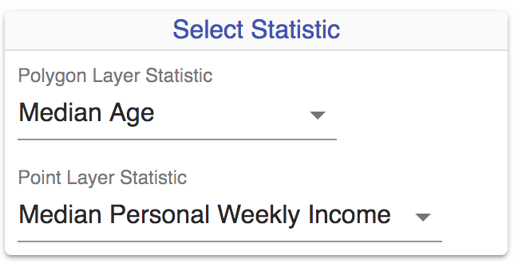
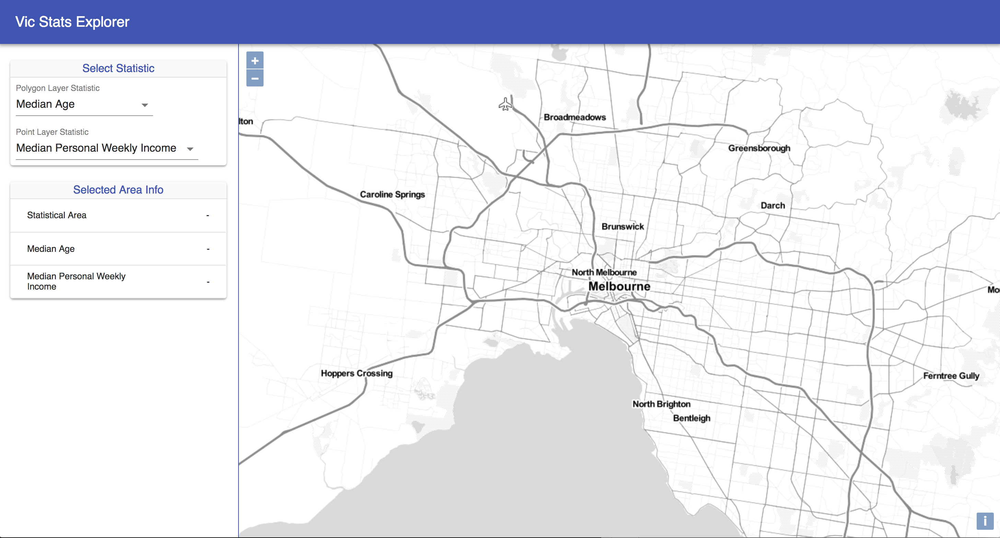

# 0 to 100 on AWS – Building a full stack web mapping application with PostGIS, GeoServer, OpenLayers and ReactJS

#### FOSS4G SotM Oceania - Afternoon Workshop #1 - 20th November 2018

### Section 7 Stage 2 - Wire up Redux and add UI Controls

In this stage we'll extend the skeleton application create in Stage 1 to
incorporate state management using Redux, and add some UI controls.

**1.** First let's move the initial state of the map into a Redux module so
that we can pass this into the `OlMap` component props. Create a new file
`modules/map.js` with the following content. This file will manage the
initial state and the actions to update the state related to the map. At this
stage we'll also add some initial state for the point and polygon layers to be
displayed on the map, including a couple of different styles that can be
applied to each. We'll configure more styles later, but this gives us some
state to work with when setting up our UI controls.

```
import Immutable from 'immutable'

const initialState = Immutable.fromJS({
  baseGeoserverUrl: process.env.REACT_APP_BASE_GEOSERVER_URL,
  mapOptions: {
    center: [16137312, -4553696],
    zoom: 11
  },
  polygonLayer: {
    name: 'abs_stats_poly',
    workspace: 'workshop',
    selectedStyle: 'median_age_persons_poly',
    styles: [
      {
        id: 'median_age_persons_poly',
        displayField: 'median_age_persons',
        displayName: 'Median Age',
        workspace: 'workshop',
        templateStyle: 'poly_green'
      },
      {
        id: 'median_tot_prsnl_inc_weekly_poly',
        displayField: 'median_tot_prsnl_inc_weekly',
        displayName: 'Median Personal Weekly Income',
        workspace: 'workshop',
        templateStyle: 'poly_green'
      }
    ]
  },
  pointLayer: {
    name: 'abs_stats_point',
    workspace: 'workshop',
    selectedStyle: 'median_tot_prsnl_inc_weekly_point',
    styles: [
      {
        id: 'median_age_persons_point',
        displayField: 'median_age_persons',
        displayName: 'Median Age',
        workspace: 'workshop',
        templateStyle: 'point_pink'
      },
      {
        id: 'median_tot_prsnl_inc_weekly_point',
        displayField: 'median_tot_prsnl_inc_weekly',
        displayName: 'Median Personal Weekly Income',
        workspace: 'workshop',
        templateStyle: 'point_pink'
      }
    ]
  }
})

export default (state = initialState, action) => {
  switch (action.type) {
    default:
      return state;
  }
};
```

**2.** Now add a file `modules/index.js` with the following content. This file combines different Redux modules together (in this case we only have one module) to form the application state.

```
import { combineReducers } from 'redux';
import map from './map';

export default combineReducers({
  map
});
```

**3.** Next we will create a Redux store and connect it to our App using a Provider.

Add a new file `store.js` to the root `src` directory with the following content.

```
import { createStore, applyMiddleware, compose } from 'redux';
import thunk from 'redux-thunk';
import rootReducer from './modules';

const initialState = {};
const enhancers = [];
const middleware = [thunk];

const composedEnhancers = compose(applyMiddleware(...middleware), ...enhancers);

export default createStore(rootReducer, initialState, composedEnhancers);
```

Then modify `index.js` in the root `src` directory to have the following content.

```
import React from 'react';
import ReactDOM from 'react-dom';
import './index.css';
import App from './containers/app/App';
import { Provider } from 'react-redux';
import store from './store';
import * as serviceWorker from './serviceWorker';

ReactDOM.render(
  <Provider store={store}>
    <div>
      <App/>
    </div>
  </Provider>,
  document.getElementById('root')
);
serviceWorker.register();
```

**4.** Now we need to wire up Redux to the React app so that we can manage our application state.

First add the following imports to `containers/app/App.js`

```
import { bindActionCreators } from 'redux';
import { connect } from 'react-redux';
```

Then replace the final line

```
export default App;
```

with

```
const mapStateToProps = state => ({
  baseGeoserverUrl: state.map.get('baseGeoserverUrl'),
  mapOptions: state.map.get('mapOptions'),
  pointLayer: state.map.get('pointLayer'),
  polygonLayer: state.map.get('polygonLayer')
});

const mapDispatchToProps = dispatch =>
  bindActionCreators(
    {},
    dispatch
  );

export default connect(mapStateToProps, mapDispatchToProps)(App);
```

This wires up the Redux state and maps it to the `App` container props. We've also got some boilerplate to map functions that will be used to change application state later on.

**5.** Now we'll pass some of the initial map state defined in the `map.js` Redux module through to the `OlMap` component. In the `containers/app/App.js` file change the OlMap component to pass in additional `baseGeoserverUrl`, `mapOptions`, `pointLayer` and `polygonLayer` props as follows.

```
<OlMap
  style={styles.map}
  baseGeoserverUrl={this.props.baseGeoserverUrl}
  mapOptions={this.props.mapOptions}
  pointLayer={this.props.pointLayer}
  polygonLayer={this.props.polygonLayer}
/>
```

**6.** Open the `components/OlMap.js` file and within the `loadMap` method, change the `View` constructor to use the `mapOptions` prop.

```
...
self.map = new Map({
  layers: layers,
  target: 'map',
  view: new View({
    center: self.props.mapOptions.get('center').toJS(),
    zoom: self.props.mapOptions.get('zoom')
  })
})
...
```

At this point our application should not look any different but we're now using Redux to manage application state.

**7.** We'll continue to build our application by adding some UI components for selecting the statistics to display on the map, and to also provide a place for viewing query (identify) results. In the `containers/app/App.js` file modify the `SidePanel` component reference the JSX so that it receives `pointLayer` and `polygonLayer` props. The styles that are configured for each of these layers will be used to populate UI controls to allow the user to select which statistic to display on the map.

```
...
<SidePanel
  style={styles.sidePanel}
  pointLayer={this.props.pointLayer}
  polygonLayer={this.props.polygonLayer}
/>
...
```

**8.** Add a new file `components/SelectStatControl.js` which will host some dropdown lists to select which two statistics to display on the map. Populate it with the following content.

```
import React, { Component } from 'react'
import { withStyles } from '@material-ui/core/styles';
import Paper from '@material-ui/core/Paper'

const styles = theme => ({
  root: {
    width: '90%',
    marginLeft: 'auto',
    marginRight: 'auto',
    marginTop: theme.spacing.unit * 3,
    overflowX: 'auto'
  },
  formControl: {
    margin: theme.spacing.unit,
    minWidth: 200
  }
});

class SelectStatControl extends Component {
  render() {
    return (
      <Paper className={this.props.classes.root}>
      </Paper>
    )
  }
}

export default withStyles(styles)(SelectStatControl);
```

**9.** Now modify the `components/SidePanel.js` file to reference our new component. We'll also add a couple of placeholders for handling a change to the style. Modify the component to add `setPolygonStyle` and `setPointStyle` methods, and then import and add the `SelectStatControl` component in the JSX passing in the relevant props. Later on, we'll wire up some Redux actions to `setPolygonStyle` and `setPointStyle`.

```
import React, { Component } from 'react'
import SelectStatControl from './SelectStatControl'

class SidePanel extends Component {
  setPolygonStyle = (style) => {
    window.alert(`TODO: setPolygonStyle ${style}`)
  }

  setPointStyle = (style) => {
    window.alert(`TODO: setPointStyle ${style}`)
  }

  render() {
    return (
      <div style={this.props.style}>
        <SelectStatControl
          pointLayer={this.props.pointLayer}
          polygonLayer={this.props.polygonLayer}
          setPolygonStyle={this.setPolygonStyle}
          setPointStyle={this.setPointStyle}
        />
      </div>
    )
  }
}

export default SidePanel;
```

**10.** Now we'll build out the `SelectStatControl` component some more. First let's add a header component. Add a new file `components/PaperHeader.js` with the following content.

```
import React, { Component } from 'react'
import { withStyles } from '@material-ui/core/styles'
import Typography from '@material-ui/core/Typography'
import Divider from '@material-ui/core/Divider'

const styles = theme => ({
  paperHeading: {
    background: theme.palette.background.default,
    fontWeight: 400
  }
});

class PaperHeader extends Component {
  render() {
    return (
      <div>
        <Typography className={this.props.classes.paperHeading} variant="subheading" color="primary" align="center">
          {this.props.title}
        </Typography>
        <Divider />
      </div>
    )
  }
}

export default withStyles(styles)(PaperHeader);
```

**11.** Reference the header within the `components/SelectStatControl.js` component.

First import the PaperHeader component.

```
import PaperHeader from './PaperHeader'
```

Then modify the contents of the `Paper` component within the JSX.

```
...
<Paper className={this.props.classes.root}>
  <PaperHeader title="Select Statistic" />
</Paper>
...
```

**12.** Now add a new file `components/SelectStat.js` and populate with the following content. This will be the dropdown UI control used to select a style for both the `polygonLayer` and `pointLayer`.

```
import React, { Component } from 'react'
import { withStyles } from '@material-ui/core/styles';
import FormControl from '@material-ui/core/FormControl'
import InputLabel from '@material-ui/core/InputLabel'
import Select from '@material-ui/core/Select'
import MenuItem from '@material-ui/core/MenuItem'

const styles = theme => ({
  formControl: {
    margin: theme.spacing.unit,
    minWidth: 200
  }
});

class SelectStat extends Component {
  handleChange = event => {
    this.props.handleChange(event.target.value)
  }

  render() {
    let value = this.props.layer.get(
      'styles'
    ).find(
      style => style.get('id') === this.props.layer.get('selectedStyle')
    ).get('id')

    return (
      <FormControl className={this.props.classes.formControl}>
        <InputLabel htmlFor={this.props.selectId}>{this.props.label}</InputLabel>
        <Select
          value={value}
          onChange={this.handleChange}
          inputProps={{
            name: 'displayName',
            id: this.props.selectId,
          }}
        >
        {this.props.layer.get('styles').map(style => {
          return <MenuItem key={style.get('id')} value={style.get('id')}>{style.get('displayName')}</MenuItem>
        })}
        </Select>
      </FormControl>
    )
  }
}

export default withStyles(styles)(SelectStat);
```

**13.** Now we'll import and add the `SelectStat` component in the `components/SelectStatControl.js` component.

First import the `SelectStat` component.

```
import SelectStat from './SelectStat'
```

Now update the JSX to add `SelectStat` components for both the `pointLayer` and `polygonLayer`.

```
...
<Paper className={this.props.classes.root}>
  <PaperHeader title="Select Statistic" />
  <SelectStat
    selectId="polygon-select"
    label="Polygon Layer Statistic"
    handleChange={this.props.setPolygonStyle}
    layer={this.props.polygonLayer}
  />
  <SelectStat
    selectId="point-select"
    label="Point Layer Statistic"
    handleChange={this.props.setPointStyle}
    layer={this.props.pointLayer}
  />
</Paper>
...
```

**14.** At this stage, there should be two dropdown UI controls presented in the side panel of the application.



**15.** Now, we'll create an `InfoPanel` component to display the query/identify results when clicking on a statistical area on the map. Add a new file `components/InfoPanel.js` and populate with the following content.

```
import React, { Component } from 'react'
import { withStyles } from '@material-ui/core/styles';
import Paper from '@material-ui/core/Paper'
import Table from '@material-ui/core/Table'
import TableBody from '@material-ui/core/TableBody'
import TableCell from '@material-ui/core/TableCell'
import TableRow from '@material-ui/core/TableRow'
import PaperHeader from './PaperHeader'

const styles = theme => ({
  root: {
    width: '90%',
    marginLeft: 'auto',
    marginRight: 'auto',
    marginTop: theme.spacing.unit * 3,
    overflowX: 'auto'
  },
  table: {
    minWidth: 200
  },
  cellValue: {
    whiteSpace: 'nowrap'
  },
  paperHeading: {
    background: theme.palette.background.default,
    fontWeight: 400
  }
});

class InfoPanel extends Component {
  render() {
    let selectedPolygonStyle = this.props.polygonLayer.get(
      'styles'
    ).find(
      style => style.get('id') === this.props.polygonLayer.get('selectedStyle')
    )

    let selectedPointStyle = this.props.pointLayer.get(
      'styles'
    ).find(
      style => style.get('id') === this.props.pointLayer.get('selectedStyle')
    )

    let polygonValue = this.props.highlightFeatureProps ? this.props.highlightFeatureProps.get(selectedPolygonStyle.get('displayField')).toFixed(1) : '-'
    let pointValue = this.props.highlightFeatureProps ? this.props.highlightFeatureProps.get(selectedPointStyle.get('displayField')).toFixed(1) : '-'
    let saValue = this.props.highlightFeatureProps ?  + this.props.highlightFeatureProps.get('area_id') + ' (' + this.props.highlightFeatureProps.get('area_type') + ')' : '-'

    return (
      <Paper className={this.props.classes.root}>
        <PaperHeader title="Selected Area Info" />
        <Table className={this.props.classes.table}>
          <TableBody>
            <TableRow>
              <TableCell>Statistical Area</TableCell>
              <TableCell className={this.props.classes.cellValue}>{saValue}</TableCell>
            </TableRow>
            <TableRow>
              <TableCell>{selectedPolygonStyle.get('displayName')}</TableCell>
              <TableCell numeric className={this.props.classes.cellValue}>{polygonValue}</TableCell>
            </TableRow>
            <TableRow>
              <TableCell>{selectedPointStyle.get('displayName')}</TableCell>
              <TableCell numeric className={this.props.classes.cellValue}>{pointValue}</TableCell>
            </TableRow>
          </TableBody>
        </Table>
      </Paper>
    )
  }
}

export default withStyles(styles)(InfoPanel);

```

**16.** Finally, import the `InfoPanel` component to the `components/SidePanel.js` and add it to the JSX.

First import the `InfoPanel` component.

```
import InfoPanel from './InfoPanel'
```

Now update the JSX to add the InfoPanel component below the SelectStatControl.

```
<div style={this.props.style}>
  <SelectStatControl
    pointLayer={this.props.pointLayer}
    polygonLayer={this.props.polygonLayer}
    setPolygonStyle={this.setPolygonStyle}
    setPointStyle={this.setPointStyle}
  />
  <InfoPanel
    pointLayer={this.props.pointLayer}
    polygonLayer={this.props.polygonLayer}
    highlightFeatureProps={null}
  />
</div>
```
**17.** The application should now have a couple of UI controls in the side
panel and the basics of Redux wired up. If necessary, you can
[download](https://s3-ap-southeast-2.amazonaws.com/foss4g-oceania-2018-workshop-resources/client_stage_2.zip)
a copy of the `src` directory at this point.



***

**Previous**: [7.1. Skeleton app](section-7-1-skeleton-app.md) | **Up**: [Index](README.md) | **Next**: [7.3. Finish app](section-7-3-finish-app.md)
